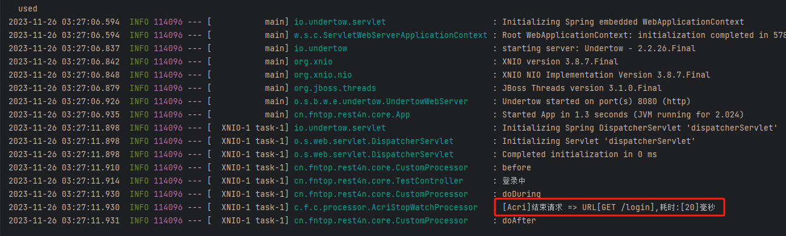

<div style="display: flex; justify-content: center;">  

</div>
<p align='center'>🍍🍍注解式自定义请求/方法拦截🍍🍍</p>


## 🍌🍌介绍
Acri（全称Annotation Custom Request Interception）

一个注解即可实现请求的拦截处理或AOP增强

## 🍊🍊特点
* 一个`@Acri`注解搞定请求拦截
* 支持自定义拦截器，自定义扩展简单易用
* 一个`@AcriAspect`注解搞定AOP切面
* 支持自定义切面类、切面方法，自定义扩展简单易用
* 支持单个方法单拦截
* 支持单个方法多个拦截
* 支持多方法多拦截
* 不管是拦截还是切面，完全实现代码与业务分离

## 🫐🫐依赖
```xml
<dependency>
    <groupId>cn.fntop</groupId>
    <artifactId>acri-spring-boot-starter</artifactId>
    <version>1.3.0</version>
</dependency>

implementation 'cn.fntop:acri-spring-boot-starter:1.3.0'
//方式2
implementation group: 'cn.fntop', name: 'acri-spring-boot-starter', version: '1.3.0'
``` 


## 🍈🍈使用方式


### 添加注解

```java
@Acri(value = AcriStopWatchProcessor.class, before = true, during = true, after = true)
@GetMapping("/login")
public String login() {
    log.info("登录中");
    return "登录成功";
}
```
### 效果




## 🍐🍐注解说明
`@Acri(value = AcriStopWatchProcessor.class, before = true, during = true, after = true)`

| 配置项    | 默认值   | 备注                                 |
|:-------|:------|:-----------------------------------|
| value  | null  | 具体拦截处理器，实现AcriProcessor并注入Spring容器 |
| before | false | 是否处理请求前执行doBefore方法                |
| during | false | 是否处理请求方法后执行doDuring方法              |
| after  | false | 是否在返回响应后执行doAfter方法                |

`@Acries(acries = {@Acri(value = AcriStopWatchProcessor.class, before = true, after = true)
, @Acri(value = CustomProcessor.class, before = true, after = true)})` 
如果存在`@Acries`注解，则`@Acri`注解不起作用

| 配置项    | 默认值   | 备注                                 |
|:-------|:------|:-----------------------------------|
| acries  | null  | 多@Acri拦截 |

## 🍉🍉自定义拦截
```java
@Slf4j
@Component
public class CustomProcessor implements AcriProcessor {
    @Override
    public void doBefore(HttpServletRequest request, HttpServletResponse response, Object handler) {
        log.info("before");
    }

    @Override
    public void doDuring(HttpServletRequest request, HttpServletResponse response, Object handler, ModelAndView modelAndView) {
        log.info("doDuring");
    }
    @Override
    public void doAfter(HttpServletRequest request, HttpServletResponse response, Object handler, Exception ex) {
        log.info("doAfter");
    }
}
```

## 🍏🍏多拦截支持

```java
@Acries(acries = {@Acri(value = AcriStopWatchProcessor.class, before = true, after = true)
            , @Acri(value = CustomProcessor.class, before = true, after = true)})
@GetMapping("/login")
public String login() {
    log.info("登录中");
    return "登录成功";
}
```


